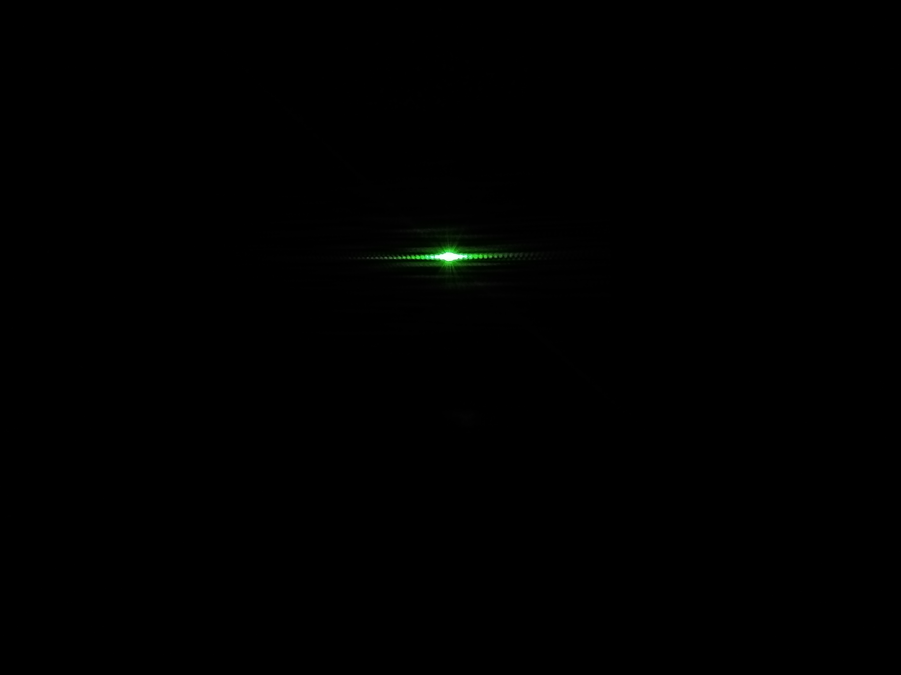

# Calculadora de numeros complejos

Este proyecto consiste en desarrollar una libreria la cual se capaz de realizar operaciones con numeros complejos.
## Numeros Complejos
*Adicion.
*Resta.
*Conjugado.
*Inverso.
*Multiplicacion.
*Division.
*Modulo.
*Fase.
*Producto escalar.
*Representacion polar y cartesiana.
## Matrices Complejas
*Suma
*Resta
*Conjugado
*Multiplicacion
*Adjunta
*Inverso
*Producto tensor
*Producto escalar

## Comenzando 🚀

_Estas instrucciones te permitirán obtener una copia del proyecto en funcionamiento en tu máquina local para propósitos de desarrollo y pruebas._

Mira **Deployment** para conocer como desplegar el proyecto.

### Pre-requisitos 📋

Debe tener instalado en su computador Python en lo posible la version 3.7, lo cual lo puede hacer desde su pagina oficial y siguiendo los pasos de instalacion.

### Instalación 🔧

Para instalar y ejecutar esta libreria lo que debe hacer es ejecutar el IDLE de Python y desde ahí abrir los archivos para ejecutarlo.

## Ejecutando las pruebas ⚙️

Para ejecutar de manera correcta las pruebas lo que se necesita hacer es abrir el archivo Pruebas.py y ejecutarlas(f5).
# Prueba de producto escalar
```
def test_producto_scalar(self):
        mat1 = [(6,3),(0,0),(5,1),(4,0)]
        scalar = (3,2)
        resultado = Complex.productoScalarMatriz(scalar,mat1)
        self.assertEqual(resultado,[(12, 21), (0, 0), (13, 13), (12, 8)])
```

### Analice las pruebas end-to-end 🔩

Todas las pruebas realizadas son para hacer una comprobacion del correcto funcionamienito de todos los metodos realizados y poniendo en evidencia todas sus funcionalidades.

```
self.assertEqual(Complex.productoInterno(Complex.sumaMatrices(mat1,mat2),mat3),[[1,-2],[3,4]])
```
## Experimento de la Roble Rendija
En este experimento utilizamos un láser y un trozo de papel aluminio pegado a una octavo de papel cartón con dos cortes horizontales en el papel muy pegados entre sí. Apuntamos el laser a el medio de los dos cortes del papel aluminio logrando así que la luz del láser pase a través de los dos cortes, lo que produce que las ondas de luz que atraviesan estos dos cortes produzcan una interferencia entre si , logrando una distorsión y generando así el patrón de luz que podemos observar.

Como podemos ver en la imagen la luz del lazer se distorciona en varios puntos generando asi este patron.
## Construido con 🛠️

* [Python](https://www.python.org/) - Python 3.7 - Usado para desarrollar la libreria.

## Autores ✒️

_Menciona a todos aquellos que ayudaron a levantar el proyecto desde sus inicios_

* **Carlos Murillo** - *Desarrollo* - [Camu10](https://github.com/Camu10)
